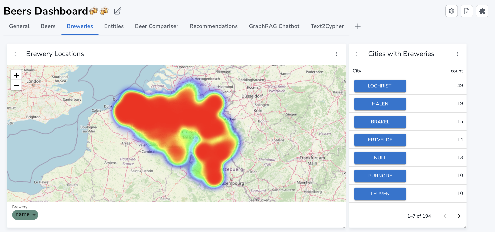
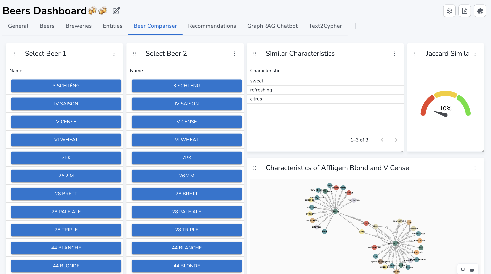
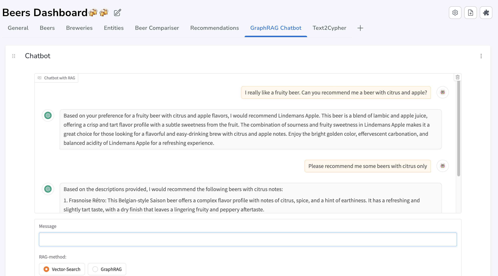

# Beer Graph

The following project contains all the files needed to run the Beer Graph Demo. The following is needed to run the demo: 
- **Dump file**: Neo4j snapshot with the data used in the Demo. Version is 5.26-aura. 
- **Dashboard file**: JSON source to run the NeoDash application running the dashboard. Version is 2.4. 
- **Code**: Notebooks and credentials to prepare the data and to run the chatbot shown in NeoDash. The Python Notebook with the Chatbot needs to be run locally to support an IFrame in NeoDash. 

# Dashboard Overview

## Brewery Locations
   

## Beer Compariser
   

## Beer Chatbot
   